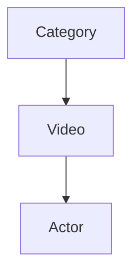

# netflixCleanArquitecture

## DDBB

TODO before start:
 
 *Lombok*
 
 Download lombok library and install it
 
 *SetUp DataBase*
 
  *Execute the app
 
 *Go to http://localhost:8100/h2-console
  
  *Login with the credentials written into app.properties
  
  *Execute all sql found into src/main/resource/db/migration

## Validations

**Categories**

- Name < = 25 char

**Video**

- Name <= 45 char
- lenght > 0'

**Actor**

- Age > 18 years
- Nationality == "ES"

## As a user I want to:

- [x] Get all the categories
- [x] Create new category
- [ ] Get all the videos
- [ ] Create new video
- [ ] Get all the actors
- [ ] Create new actor
- [ ] Assign category to a video
- [ ] Assign actor to a video
- [ ] Get all categories from an actor
